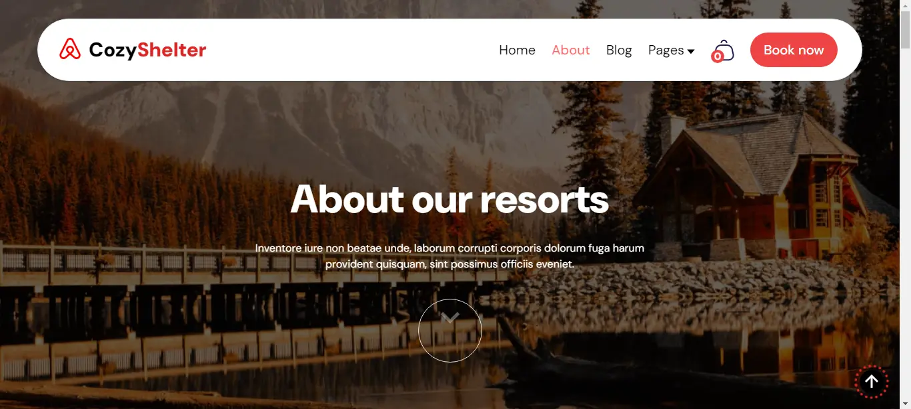
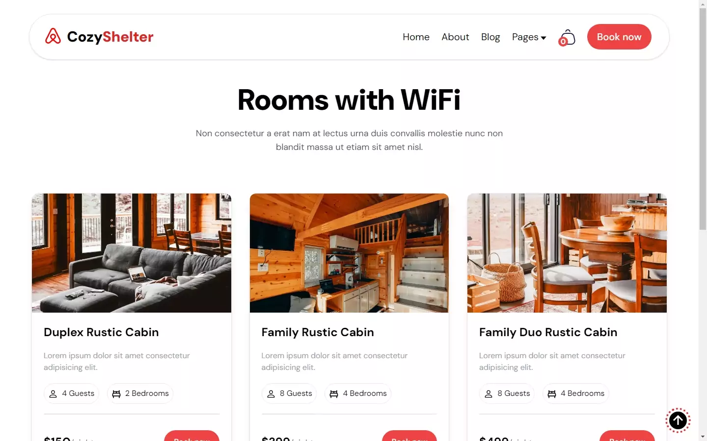

# COZY SHELTER

### Description

An Airbnb Website called Cozy Shelter. My latest project with an amazing UI and offering a great user experience. It has 8 pages and some smooth animations within them. The website is mobile responsive.

### Table of Contents

1. <a href='#tech'>Technologies used</a>  
2. <a href='#views'>Views</a>  
3. <a href='#link'>Live Link</a>  
4. <a href='#author'>Author</a>

### Technologies Used 

  - JavaScript
  - React
  - Tailwind CSS
  - CSS

### Views 

Here are some of the views of the page. The remaining pieces of the UI can be seen on the website by visiting the live link below.

   

     

     

     

     

     

     

     

     

     

     

     

     

     

### Live link 

<a href='https://cozy-shelter.vercel.app/'>Cozy Shelter</a>

### Author 

<a href='https://www.linkedin.com/in/patrick-njiru-7569241ba'>Patrick Njiru</a>

